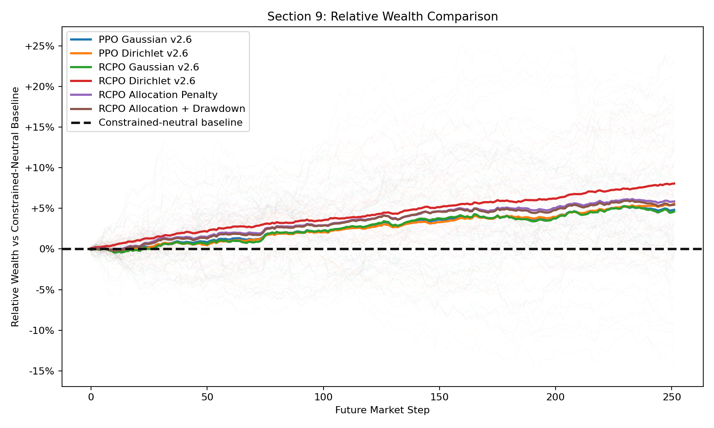
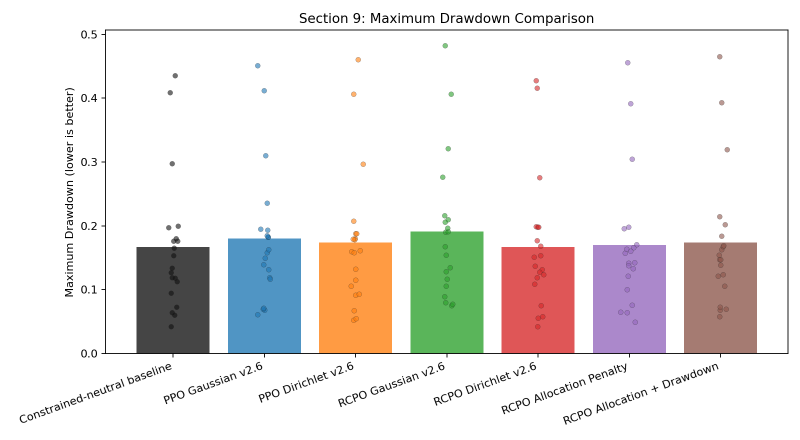
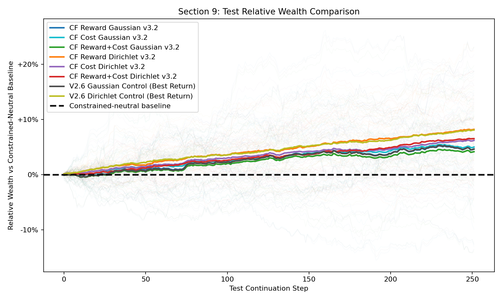
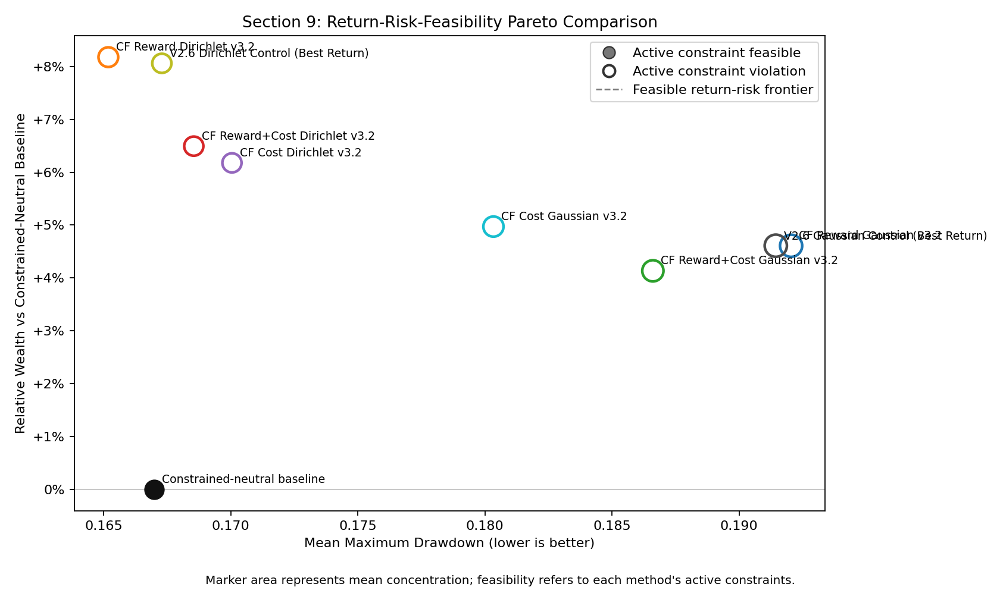
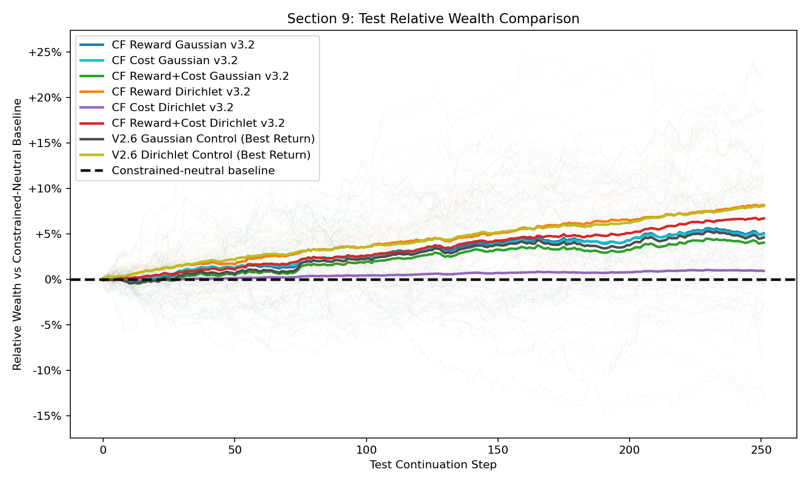
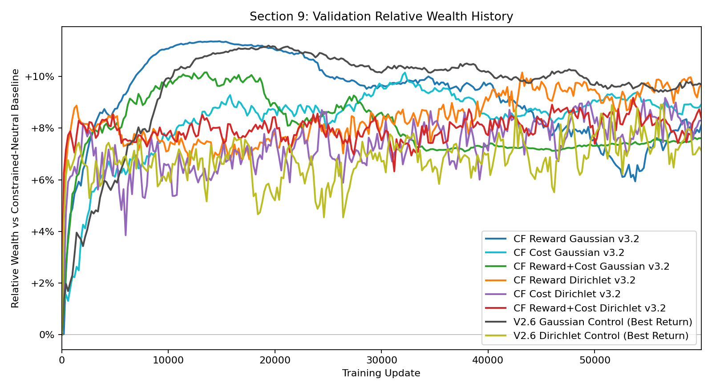

# Constraint-Aware Simplex Decomposition for Robust Portfolio Reinforcement Learning

**MEng Research Project — Final Report Draft**  
**Student:** Housen Zhu  
**Supervisor:** A. Bereyhi  
**Status:** September 2026 working draft

## Abstract

This project studies constrained portfolio reinforcement learning (RL) in a setting where two kinds of constraints must be handled differently. Static allocation requirements, such as minimum exposure to asset groups, require every action to be feasible. Path-dependent requirements, such as drawdown control, depend on the realised portfolio history and cannot be enforced by a static action projection alone. The proposed framework therefore combines **Simplex Decomposition** for hard allocation feasibility with **Reward-Constrained Policy Optimization (RCPO)** for adaptive drawdown control.

The implementation uses a synthetic multi-regime market with cash plus eight risky assets, transaction costs, multi-market training, and branch-based out-of-sample evaluation. The action policy uses a CAOSD-style decomposition of the constrained simplex and supports autoregressive Gaussian-logit and Dirichlet branch distributions. RCPO uses a benchmark-relative current-drawdown cost, dynamic cost tolerance, and a single global Lagrange multiplier. V3.2 extends the method with open-loop counterfactual branch credit and is evaluated at the same 60,000-update budget as the V2.6 standalone-credit controls.

On 20 shared unseen one-year continuation markets, the strongest V3.2 return-best policy is counterfactual-reward Dirichlet RCPO, with a mean terminal relative-wealth gain of **+8.18%** and an 85% win rate versus the constrained-neutral baseline. This is only a small improvement over the V2.6 Dirichlet control (**+8.06%**, 90% win rate), and it requires higher turnover. Counterfactual-cost Gaussian RCPO improves drawdown and feasible-branch rate relative to its V2.6 Gaussian control, but the joint counterfactual reward-and-cost variants do not consistently dominate. Hard allocation feasibility is maintained by construction, while reliable drawdown feasibility remains unresolved. The evidence is primarily single-seed synthetic-market evidence, and reward correction under naturally imperfect financial feedback remains a later project milestone.

## 1. Introduction

Portfolio management is a sequential decision problem. At each trading time, an investor observes market information and current holdings, reallocates capital across assets, incurs trading costs, and receives a return. Reinforcement learning is a natural framework for this process because a portfolio decision changes both current return and the state from which future decisions are made.

However, a portfolio policy that maximises return alone is not necessarily practical. First, investors may impose allocation requirements: selected asset groups must receive a minimum total weight, all positions must be long-only, and weights must sum to one. Second, a feasible allocation can still have undesirable path behaviour, such as a severe drawdown. Third, apparent success on a single simulated price path can be caused by path memorisation rather than a reusable allocation rule.

This project addresses these issues through a hybrid view of constraints:

1. **Allocation constraints are structural.** They should be satisfied by the policy action map for every action, rather than only encouraged by a reward penalty.
2. **Drawdown is path dependent.** It is handled with a constrained RL cost signal and a Lagrange multiplier that adapts during training.
3. **Generalisation must be measured explicitly.** Models are trained across multiple independent synthetic markets and selected using multiple future continuation branches.

The central research question is:

> Can Simplex Decomposition guarantee portfolio allocation feasibility while an RCPO-inspired risk-control layer improves return-risk behaviour on unseen market continuations?

The project makes four practical contributions:

- A CAOSD-style constrained-simplex action mapper for long-only portfolio allocation.
- Autoregressive Gaussian-logit and Dirichlet branch policies that can be optimised with PPO or RCPO.
- A benchmark-relative current-drawdown RCPO objective with observable drawdown state, dynamic alpha, and one global multiplier update per rollout.
- A multi-market experimental framework with constrained-neutral benchmarking, branch-based checkpoint selection, and a counterfactual branch-credit extension.

## 2. Problem Formulation

### 2.1 Portfolio Markov decision process

The environment contains one cash asset and (N=8) risky assets. At time (t), the portfolio allocation is

\[
w_t \in \Delta^{N} = \left\{w \in \mathbb{R}^{N+1}_{+}: \sum_{j=0}^{N} w_{t,j}=1\right\},
\]

where index 0 denotes cash. The risky-asset return vector is (R_t \in \mathbb{R}^{N}), and the raw portfolio return is

\[
r^{\mathrm{raw}}_t = w_{t,1:N}^{\top} R_t.
\]

Rebalancing has an L1 turnover cost. With transaction-cost rate \(\kappa\), net simple return and the clean learning reward are

\[
r^{\mathrm{net}}_t = r^{\mathrm{raw}}_t - \kappa\lVert w_t-w_{t-1}\rVert_1,
\qquad
r_t = \log(1+r^{\mathrm{net}}_t).
\]

The observation contains trailing risky returns, rolling return means and volatilities, current portfolio weights, turnover, allocation diagnostics, and drawdown state. The market regime is latent: the policy must infer it from observable market history.

Each episode lasts 252 trading steps. Episodes start from a constrained-neutral feasible CAOSD portfolio rather than from all cash, so the benchmark and the learned simplex policy begin from the same feasible allocation class.

### 2.2 Hard allocation constraints

The Experiment 2 environment uses two overlapping minimum-exposure constraints:

\[
\sum_{j \in V_1} w_j \ge 0.50,
\qquad
V_1=\{\text{Asset 1},\text{Asset 4},\text{Asset 6}\},
\]

\[
\sum_{j \in V_2} w_j \ge 0.40,
\qquad
V_2=\{\text{Asset 2},\text{Asset 4},\text{Asset 7}\}.
\]

Asset 4 is shared by the two groups. The constraints are intentionally designed so that no single high-return asset can trivially satisfy both groups. Since the thresholds sum to 0.90, the mandatory intersection mass is zero in this configuration, but the overlap remains part of the feasible action geometry.

### 2.3 Benchmark-relative drawdown constraint

The constrained-neutral CAOSD portfolio is tracked online on the same realised market path. Let (P_t) and (P_t^B) be agent and benchmark wealth, and let (D_t) and (D_t^B) be their current drawdowns from their respective running peaks:

\[
D_t=\frac{\max_{s\le t}P_s-P_t}{\max_{s\le t}P_s},
\qquad
D_t^B=\frac{\max_{s\le t}P_s^B-P_t^B}{\max_{s\le t}P_s^B}.
\]

The online drawdown budget, violation, and cost are

\[
b_t=\max(0.05,\;0.90D_t^B),
\qquad
v_t=\max(0, D_t-b_t),
\qquad
c_t=\frac{v_t^2}{0.10}.
\]

This cost differs from a fixed maximum-drawdown penalty. It is active only while the portfolio is more underwater than the benchmark-relative budget and returns to zero after recovery. Maximum drawdown remains an important evaluation statistic.

### 2.4 Evaluation objective

Evaluation uses a constrained-neutral baseline, not unconstrained arithmetic \(1/N\) allocation. The reported return measure is terminal relative wealth:

\[
\mathrm{RelativeWealth}_T = \frac{P_T}{P_T^B}-1.
\]

This compares each learned policy against a portfolio that satisfies the same hard allocation requirements. A positive value therefore indicates wealth above the feasible neutral baseline.

## 3. Methodology

### 3.1 Synthetic multi-market environment

The market generator has persistent low- and high-volatility regimes, regime-dependent asset winners, mild momentum, and regime-dependent correlations. Assets 1–2 are relatively stronger in low-volatility regimes, while defensive assets receive stronger drift adjustments in high-volatility regimes. The regime label is not exposed to the policy.

Training uses a pool of eight deterministic but distinct markets. At each episode reset, the environment samples one train market uniformly. This avoids repeatedly fitting one historical simulation path. Validation uses ten future continuation branches and test reporting uses twenty disjoint future continuation branches from the anchor market endpoint.

### 3.2 CAOSD Simplex Decomposition

Following Winkel et al., the constrained portfolio polytope is represented by simplex subproblems. For two allocation groups, branch simplexes correspond to the intersection \(V_1\cap V_2\), the first group \(V_1\), the second group \(V_2\), and the full asset universe. Each branch produces an allocation (y_i), and the final portfolio is

\[
w = z_1y_1+z_2y_2+z_3y_3+z_4y_4,
\]

where the non-negative coefficients (z_i) sum to one and are derived from the allocation thresholds and branch allocations. The mapper reconstructs the full portfolio after every action and verifies non-negativity, unit sum, and group constraints.

This produces a key separation from a soft penalty baseline: CAOSD allocation violation is zero up to numerical precision before any reward optimisation occurs. A soft RCPO allocation penalty can reduce violations, but cannot guarantee feasibility for each action.

### 3.3 Autoregressive policy distributions

Two policy parameterisations are evaluated.

| Architecture | Branch action | Conditioning | Main motivation |
|---|---|---|---|
| Autoregressive Gaussian | Real-valued branch logits, then branch softmax | Each later head receives previous branch softmax allocations | Stable continuous-control parameterisation |
| Autoregressive Dirichlet | Positive branch weights sampled from bounded Dirichlet concentrations | Each later head receives prior branch weights | Direct distribution on branch simplexes |

Both architectures use a shared MLP encoder with separate branch actor heads. The branch action outputs are passed through the CAOSD mapper, so the final portfolio is feasible regardless of the action distribution.

### 3.4 PPO and RCPO optimisation

PPO uses the clipped likelihood-ratio objective

\[
L^{\mathrm{PPO}}(\theta)=
\mathbb{E}\left[
\min\left(\rho_t(\theta)A_t,
\operatorname{clip}(\rho_t(\theta),1-\epsilon,1+\epsilon)A_t\right)
\right].
\]

RCPO combines return and cost advantages:

\[
A_t^{\mathrm{RCPO}}=A_t^R-\lambda A_t^C.
\]

Dynamic alpha expresses the allowed cost in the same units as the squared drawdown cost:

\[
\alpha_t=\frac{(0.05b_t)^2}{0.10}.
\]

The multiplier is updated once per rollout from the actual combined portfolio cost, not from branch shadow costs:

\[
\lambda \leftarrow \max\left(0,\lambda+eta_\lambda(\bar c-\bar\alpha)\right).
\]

The one-update-per-rollout rule prevents the number of PPO epochs or minibatches from unintentionally changing the multiplier timescale. Optimisation also records branch KL, entropy, clip fraction, gradient norms, critic explained variance, and rejected minibatches for diagnosing unstable learning.

### 3.5 Branch credit assignment

The original standalone-credit design gives branch (i) its own shadow portfolio return while RCPO cost remains global. This avoids assigning the same joint advantage to all branches, but it remains an approximation because CAOSD branch masses, transaction costs, and autoregressive dependencies interact.

V3.2 introduces an open-loop counterfactual credit signal. For each active branch, its realised action is replaced with a neutral action, while other realised branch actions are held fixed. The complete CAOSD mapping is rerun:

\[
w_t^{\mathrm{actual}}=\operatorname{CAOSD}(a_{1,t},\ldots,a_{4,t}),
\]

\[
w_{t}^{-i}=\operatorname{CAOSD}(a_{1,t},\ldots,a^{\mathrm{neutral}}_{i,t},\ldots,a_{4,t}).
\]

Each counterfactual keeps its own turnover, wealth, peak, and drawdown path on the same market return. The marginal reward and cost signals are

\[
\Delta r_{i,t}=r_t^{\mathrm{actual}}-r_{i,t}^{\mathrm{cf}},
\qquad
\Delta c_{i,t}=c_t^{\mathrm{actual}}-c_{i,t}^{\mathrm{cf}}.
\]

Three V3.2 variants are considered: counterfactual reward with global cost; standalone reward with counterfactual cost; and counterfactual reward with counterfactual cost. In all variants, lambda remains global and is updated only from the non-negative actual portfolio cost. The counterfactual is open-loop rather than an unbiased causal estimator because downstream autoregressive actions are held fixed.

### 3.6 Experimental protocol

The completed V2.6 and V3.2 experiments use 60,000 updates and the same market seed. Gaussian policies use three PPO epochs per rollout and Dirichlet policies use four; each rollout contains 2,048 steps, minibatch size is 512, and the network has hidden sizes [192, 128]. Validation is evaluated every 200 updates. The return-best checkpoint is chosen using mean validation excess cumulative return; a separate feasible-best checkpoint prioritises validation feasible-branch rate and then validation return.

All final comparisons use deterministic policy actions and the same 20 clean future continuation markets. No reward noise or reward correction is active in the current core simplex experiments.

## 4. Numerical Experiments

### 4.1 Evaluation metrics

The main metrics are mean terminal relative wealth, future-branch win rate versus constrained-neutral, annualised return and volatility, mean maximum drawdown, average turnover, allocation violation, active RCPO constraint cost, and active constraint feasible-branch rate. Allocation feasibility and active drawdown feasibility are reported separately: a simplex policy can be perfectly allocation feasible while still failing its drawdown cost target.

### 4.2 V2.6 completed 60,000-update comparison

Table 1 summarises return-best checkpoints evaluated over 20 common, unseen, one-year continuation markets. The two RCPO soft-penalty rows are intentionally included as baselines: unlike CAOSD they do not enforce allocation feasibility structurally.

| Policy | Relative wealth | Win rate | Mean max drawdown | Avg. turnover | Active feasible branches | Allocation feasibility |
|---|---:|---:|---:|---:|---:|---:|
| PPO Gaussian | +4.83% | 75% | 17.99% | 9.16% | n/a | 100% |
| PPO Dirichlet | +5.58% | 70% | 17.41% | 15.47% | n/a | 100% |
| RCPO Gaussian | +4.61% | 70% | 19.14% | 1.91% | 15% | 100% |
| **RCPO Dirichlet** | **+8.06%** | **90%** | **16.73%** | 14.27% | 40% | 100% |
| RCPO allocation penalty | +5.86% | 80% | 16.99% | 8.65% | 0% | not guaranteed |
| RCPO allocation + drawdown | +5.46% | 75% | 17.43% | 6.82% | 0% | not guaranteed |
| Constrained-neutral baseline | 0.00% | — | 16.70% | 0.00% | — | 100% |

The best completed return result is RCPO Dirichlet. It improves terminal wealth by 8.06% on average relative to the feasible neutral benchmark and outperforms the benchmark in 18 of 20 branches. Its average drawdown is close to the baseline, although only 40% of branches satisfy the strict active drawdown-cost criterion. Therefore, the result supports the usefulness of the hybrid design, but does not establish reliable risk feasibility.

The soft allocation-penalty baselines produce competitive returns but have zero active allocation-feasible branches under their own constraint definition. This is expected: an expected soft penalty can reduce violations but cannot guarantee action-by-action feasibility. In contrast, all simplex policies maintain zero allocation violation by construction.

### 4.3 V3.2 counterfactual branch-credit study: completed 60,000-update evidence

V3.2 holds the V2.6 market, seed, allocation constraints, drawdown objective, and evaluation branches fixed. It changes the branch reward and/or branch cost credit signal. Table 2 compares the six V3.2 return-best checkpoints with the two V2.6 standalone-credit controls on the same 20 test continuation markets.

| Policy | Relative wealth | Win rate | Mean max drawdown | Avg. turnover | Active feasible branches |
|---|---:|---:|---:|---:|---:|
| CF reward, Gaussian | +4.61% | 70% | 19.20% | 0.96% | 10% |
| **CF cost, Gaussian** | **+4.97%** | **75%** | **18.03%** | 7.22% | **30%** |
| CF reward + cost, Gaussian | +4.13% | 65% | 18.66% | 4.25% | 10% |
| **CF reward, Dirichlet** | **+8.18%** | 85% | **16.52%** | 24.00% | **45%** |
| CF cost, Dirichlet | +6.18% | 85% | 17.00% | 17.14% | 40% |
| CF reward + cost, Dirichlet | +6.49% | 75% | 16.85% | 22.89% | 35% |
| V2.6 Gaussian control | +4.61% | 70% | 19.14% | 1.91% | 15% |
| V2.6 Dirichlet control | +8.06% | **90%** | 16.73% | 14.27% | 40% |

The result is architecture dependent rather than a uniform counterfactual improvement. For Gaussian policies, counterfactual cost raises relative wealth by approximately 0.36 percentage points over the V2.6 Gaussian control, reduces mean maximum drawdown by approximately 1.11 percentage points, and doubles the test feasible-branch rate from 15% to 30%. This improvement is accompanied by substantially higher turnover. Counterfactual reward alone is effectively tied with the Gaussian control, while the joint reward-and-cost variant performs worse on return and feasibility.

For Dirichlet policies, counterfactual reward produces the strongest mean return and the lowest drawdown in the complete comparison. However, its +8.18% relative wealth is only 0.12 percentage points above the V2.6 Dirichlet control, its win rate is lower, and turnover rises from 14.27% to 24.00%. The evidence therefore suggests a useful marginal credit signal, but not a decisive improvement over standalone credit. The joint counterfactual formulation again fails to show additive benefit.

### 4.4 Best-feasible checkpoint comparison

The best-feasible checkpoint first maximises validation feasible-branch rate and then validation return. This is a model-selection rule, not a guarantee that the selected checkpoint will remain feasible on unseen test branches. Table 3 reports the six V3.2 best-feasible checkpoints. The V2.6 reference lines in the associated figures remain explicitly labelled best-return controls because those older runs did not save independent best-feasible checkpoints.

| V3.2 best-feasible policy | Relative wealth | Win rate | Mean max drawdown | Avg. turnover | Test feasible branches |
|---|---:|---:|---:|---:|---:|
| CF reward, Gaussian | +5.06% | 70% | 18.77% | 2.11% | 20% |
| CF cost, Gaussian | +4.97% | 75% | 18.03% | 7.22% | 30% |
| CF reward + cost, Gaussian | +4.03% | 65% | 18.64% | 3.84% | 10% |
| **CF reward, Dirichlet** | **+8.18%** | **85%** | **16.52%** | 24.00% | **45%** |
| CF cost, Dirichlet | +0.92% | 65% | 16.74% | **0.61%** | 40% |
| CF reward + cost, Dirichlet | +6.70% | 80% | 17.00% | 14.92% | 40% |

For two variants, the same checkpoint is both return-best and feasible-best. For other variants, prioritising validation feasibility changes the selected policy. The clearest trade-off is counterfactual-cost Dirichlet: the feasible-best checkpoint has low turnover and near-baseline drawdown, but test relative wealth falls to +0.92%. More importantly, the highest test feasible-branch rate remains only 45%. This shows that validation feasibility does not yet transfer reliably to the future-branch distribution and that the current mean-cost RCPO formulation remains the main unresolved risk-control issue.

### 4.5 Interpretation and limitations

The numerical evidence supports three conclusions.

1. **CAOSD is effective for hard allocation feasibility.** The structural mapper enforces the two group constraints for every simplex-policy action, which the soft RCPO allocation baseline does not achieve reliably.
2. **RCPO can improve return-risk behaviour, but does not yet guarantee path-risk feasibility.** The current drawdown cost and global lambda guide learning, yet at least 55% of test branches remain outside the active cost tolerance for every V3.2 checkpoint.
3. **Counterfactual branch credit is viable but not uniformly superior to standalone credit.** Counterfactual reward is most useful for the Dirichlet policy and counterfactual cost is most useful for the Gaussian policy. Applying both simultaneously does not improve either architecture consistently.

The following limitations bound the current claims:

- Results are mostly from one random policy seed and a finite set of synthetic future branches.
- Fixed validation branches can create selection bias; independent future test branches reduce but do not remove uncertainty.
- The synthetic market is deliberately learnable and does not establish live-market profitability.
- The open-loop counterfactual holds downstream actions fixed, so it is a controlled marginal-credit heuristic rather than a full causal counterfactual for an autoregressive policy.
- Best-feasible selection improves validation feasibility by design, but its test feasible-branch rate remains low and can sacrifice substantial return.

## 5. Conclusion and Next Steps

The project demonstrates a working hybrid constrained portfolio RL framework. CAOSD provides hard long-only allocation feasibility, while RCPO provides a separate mechanism for path-dependent drawdown preference. At equal 60,000-update budgets, V3.2 counterfactual-reward Dirichlet RCPO achieves the highest mean test relative wealth, but it only narrowly exceeds the V2.6 Dirichlet control and has higher turnover. Counterfactual-cost Gaussian RCPO offers the clearest risk-side improvement over its V2.6 control. Neither result is sufficient to claim robust drawdown feasibility, and the combined counterfactual reward-and-cost formulation is not consistently beneficial.

The following research steps are necessary:

1. Repeat the strongest configurations across at least three, and preferably five, policy seeds.
2. Select and report both return-best and feasible-best policies without using test branches for model selection.
3. Improve the risk objective using a branch-distribution-aware formulation, such as a chance or CVaR-style drawdown constraint, rather than relying only on mean rollout cost.
4. Audit counterfactual critic explained variance, advantage scales, sign balance, turnover effects, and branch-specific KL before adding further policy complexity.
5. Move to a walk-forward historical-market setting with realistic slippage, delayed execution, uncertain costs, and constrained traditional baselines.
6. Only then study reward correction under naturally imperfect state or reward feedback, using DRC/GDRC as a robustness extension rather than artificial noise as the central contribution.

## References

1. D. Winkel, N. Strauss, M. Schubert, and T. Seidl, “Simplex Decomposition for Portfolio Allocation Constraints in Reinforcement Learning,” *ECAI 2023*, pp. 2655–2662, 2023. doi: [10.3233/FAIA230573](https://doi.org/10.3233/FAIA230573).
2. C. Tessler, D. J. Mankowitz, and S. Mannor, “Reward Constrained Policy Optimization,” *ICLR*, 2019. [OpenReview](https://openreview.net/forum?id=SkfrvsA9FX).
3. J. Schulman et al., “Proximal Policy Optimization Algorithms,” 2017. [arXiv:1707.06347](https://arxiv.org/abs/1707.06347).
4. A. Kushwaha, K. Ravish, P. Lamba, and P. Kumar, “A Survey of Safe Reinforcement Learning and Constrained MDPs,” 2025. [arXiv:2505.17342](https://arxiv.org/abs/2505.17342).
5. X. Chen, Z. Zhu, and A. Perrault, “The Distributional Reward Critic Framework for Reinforcement Learning Under Perturbed Rewards,” 2024. [arXiv:2401.05710](https://arxiv.org/abs/2401.05710).
6. M. Gollart and Y. Okhrin, “A Reinforcement Learning Approach to Dynamic Portfolio Optimization,” *Annals of Operations Research*, 2025. doi: [10.1007/s10479-025-06649-x](https://doi.org/10.1007/s10479-025-06649-x).

## Artifact Sources

- Project direction: [HousenZhu_MEng_Project_Syllabus/main.tex](../HousenZhu_MEng_Project_Syllabus/main.tex)
- V2.6 design and analysis: [reports/simplex_v25_v26_progress_meeting_20260805.md](simplex_v25_v26_progress_meeting_20260805.md)
- V2.6 20-branch data: [evaluation/section9_simplex_v2.6_test_policy_comparison/section9_comparison_summary.json](../evaluation/section9_simplex_v2.6_test_policy_comparison/section9_comparison_summary.json)
- V3.2 return-best data: [evaluation/section9_simplex_v3.2_policy_comparison/section9_comparison_summary.json](../evaluation/section9_simplex_v3.2_policy_comparison/section9_comparison_summary.json)
- V3.2 best-feasible data: [evaluation/section9_simplex_v3.2_best_feasible_policy_comparison/section9_comparison_summary.json](../evaluation/section9_simplex_v3.2_best_feasible_policy_comparison/section9_comparison_summary.json)
- Full project evidence notebook: [notebooks/01_portfolio_rl_project_evaluation.ipynb](../notebooks/01_portfolio_rl_project_evaluation.ipynb)
- V3.2 meeting notebook: [notebooks/03_v3_2_counterfactual_branch_credit_meeting_report.ipynb](../notebooks/03_v3_2_counterfactual_branch_credit_meeting_report.ipynb)
