# V3.3–V3.4 Evaluation Meeting Guide

## Evaluation Protocol

All policies were evaluated on five independent anchors with 20 future one-year branches per anchor. Relative wealth is measured against the constrained-neutral CAOSD baseline. Risk comparisons use a common 0.90 drawdown margin, 0.05 floor, 0.10 cost scale, and 0.05 alpha-budget ratio.

Best-return and robust-feasible-selected checkpoints are reported separately. A robust-feasible-selected checkpoint is not assumed to remain feasible on independent holdout markets.

## Main V3.4 Results

- **Standalone 2x5040 e3:** +7.66% mean relative wealth, 28% common feasible branches, 15.53% mean maximum drawdown across 3 seeds.
- **Standalone 2x5040 e4:** +8.03% mean relative wealth, 31% common feasible branches, 15.09% mean maximum drawdown across 3 seeds.
- **Standalone 8x5040 e3:** +8.06% mean relative wealth, 28% common feasible branches, 15.50% mean maximum drawdown across 3 seeds.
- **Standalone 8x5040 e4:** +7.01% mean relative wealth, 33% common feasible branches, 14.95% mean maximum drawdown across 3 seeds.
- **Counterfactual 2x5040 e3:** +6.46% mean relative wealth, 34% common feasible branches, 14.85% mean maximum drawdown across 3 seeds.
- **Counterfactual 2x5040 e4:** +7.71% mean relative wealth, 31% common feasible branches, 15.07% mean maximum drawdown across 3 seeds.

## Data-Supported Conclusions

- **More training markets do not have a uniform main effect.** At 3 epochs, moving from 2 to 8 markets changed holdout relative wealth by +0.40% and was positive for 3/3 seeds. At 4 epochs, the effect was -1.02% and positive for 1/3 seeds.
- **A fourth optimization epoch is condition-dependent rather than reliably better.** The paired effect was +0.38% with 2 markets (1/3 seeds positive), but -1.04% with 8 markets (0/3 positive).
- **Counterfactual reward shows a return-risk trade-off, not a general return gain.** At 3 epochs the treatment-minus-control return effect was -1.20%, with the treatment higher for 0/3 seeds, while common feasibility changed by +6.7% and maximum drawdown by -0.68%. At 4 epochs its return effect was -0.33% (0/3 positive).
- **Checkpoint selection creates a material risk-return trade-off.** Across the six replicated V3.4 conditions, best-return checkpoints averaged +7.49% relative wealth and 30.7% common feasibility. Robust-feasible-selected checkpoints averaged +3.58% and 45.4%, with mean maximum drawdown changing from 15.17% to 14.35%.
- **Tightening the training margin did not improve risk under the common rule in this single-seed sweep.** Relative to margin 0.90, margin 0.85 changed return by -4.62% and common feasibility by -10.0%; margin 0.80 changed them by -1.58% and -2.0%.
- **Validation selection remains optimistic.** Mean holdout minus selected-validation relative wealth was v2.6 -1.72%, v3.2 -1.99%, v3.3 -1.83%, v3.4 -3.50%. V3.4 has the largest average gap in this comparison.

## V3.3 Exploratory Evidence

- With two training markets, increasing each path from 5,040 to 10,080 steps raised holdout relative wealth from +8.13% to +9.17%; extending again to 20,160 steps reduced it to +7.74%. Longer paths therefore did not improve monotonically.
- The 8x10,080 condition traded some return (+8.07%) for the strongest V3.3 market-design risk result: 42% common feasibility and 14.17% mean maximum drawdown.
- Counterfactual-reward Dirichlet produced the highest V3.3 method-ablation best-return result (+9.72%), but only 29% common feasibility. This is single-seed evidence and should not be ranked above the replicated V3.4 conditions.

## Window And Margin Findings

- Window 60 achieved the highest exploratory return (+8.85%) but also the highest maximum drawdown (16.15%) and lowest common feasibility (24%). Window 20 was more balanced at +8.26% return, 15.17% drawdown, and 31% feasibility.
- The margin sweep is not evidence that a stricter training budget makes the learned policy safer: both stricter settings reduced common-0.90 feasibility relative to the matched margin-0.90 seed. The own-rule curves are retained to show how the policy was trained, while the common-rule curves support the cross-margin conclusion.

## Figure Index

### Cross-version return-risk evidence

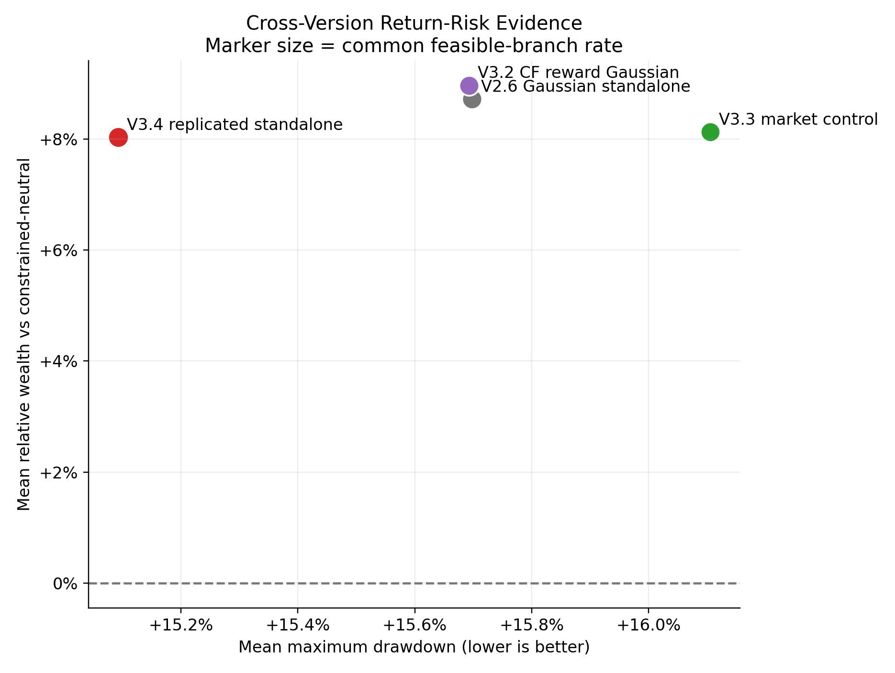

### Checkpoint return-risk trade-off

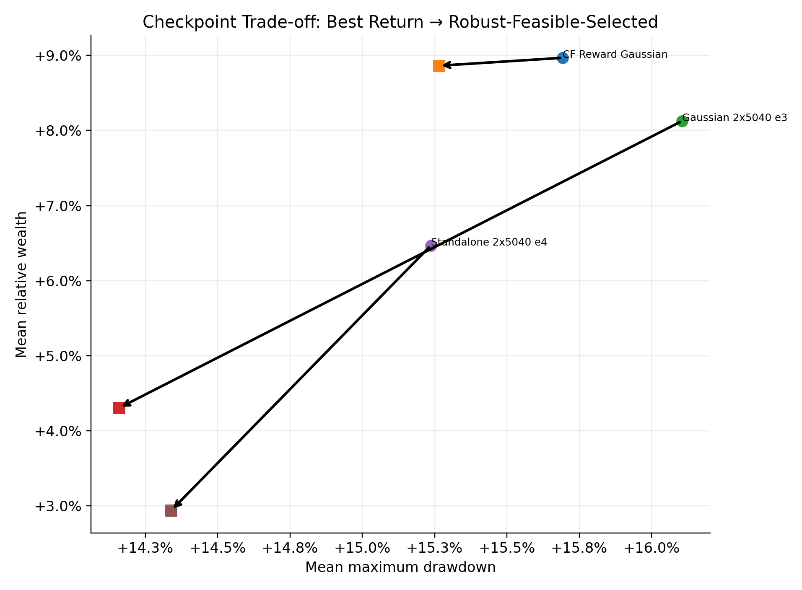

### Selected holdout wealth paths

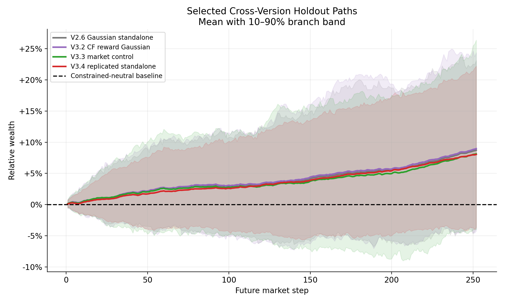

### V3.3 market-count and train-length study

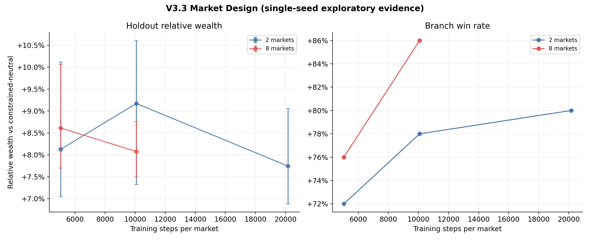

### V3.3 method ablation

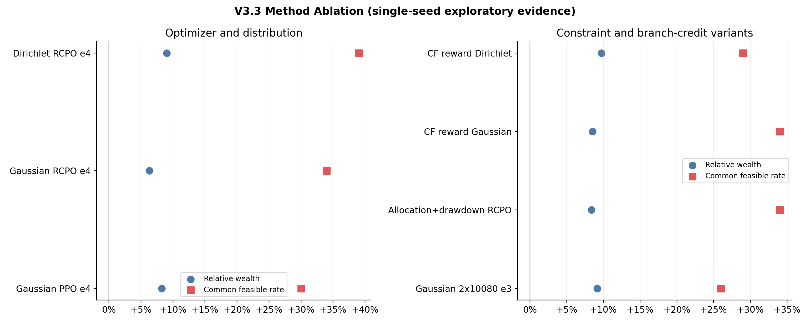

### V3.4 replicated factorial, best-return checkpoints

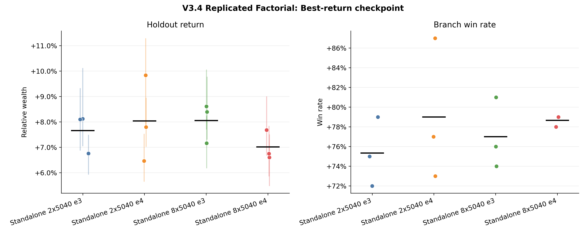

### V3.4 robust-feasible-selected checkpoints

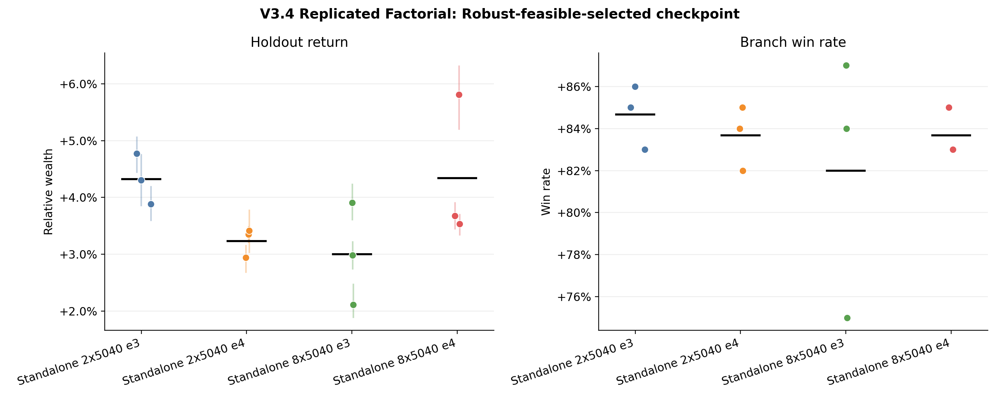

### V3.4 robust-feasible-selected risk

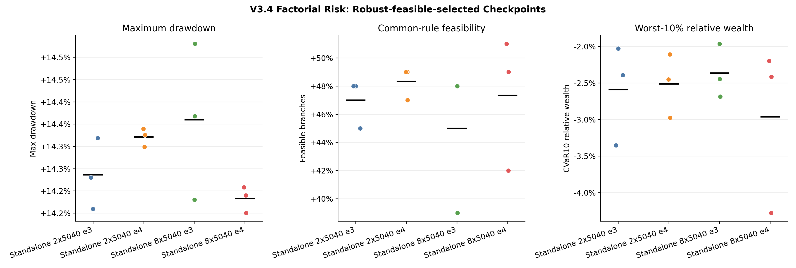

### Paired market-count and epoch effects

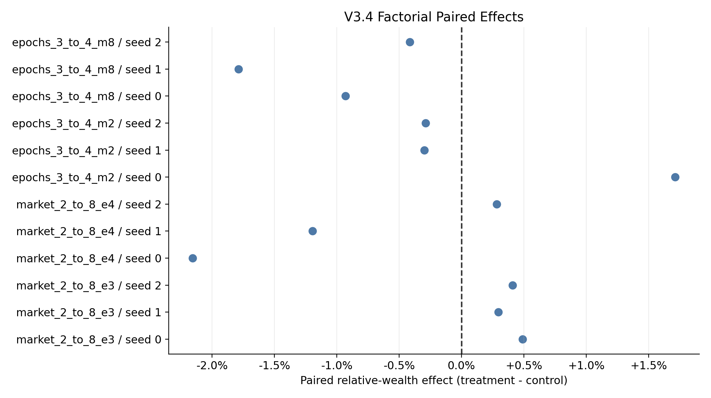

### Standalone versus counterfactual reward

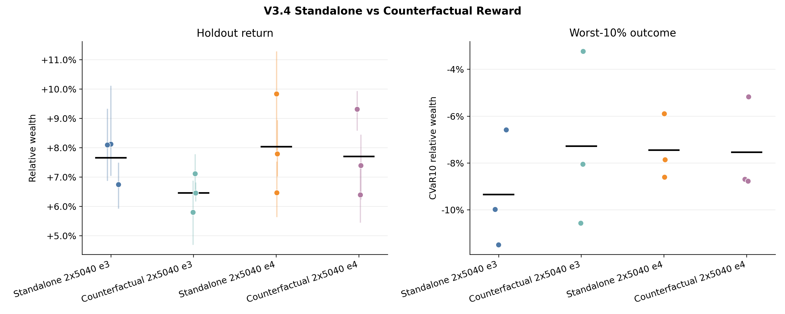

### Credit comparison, robust-feasible-selected checkpoints

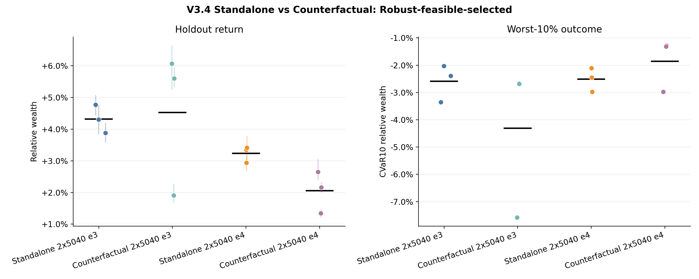

### Observation-window sweep

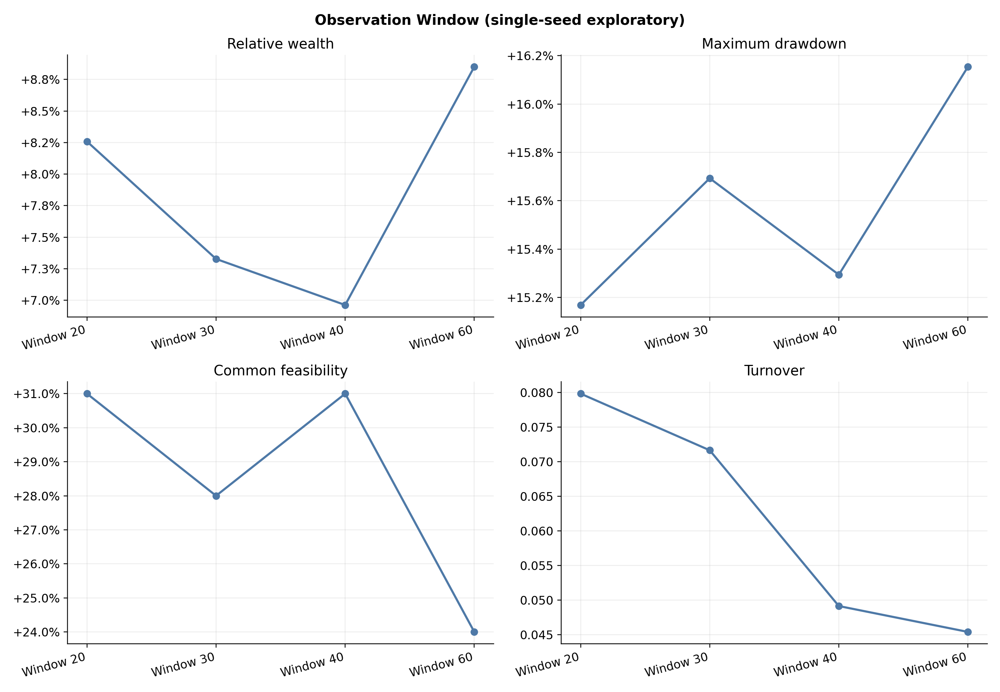

### Observation-window robust-feasible-selected sweep

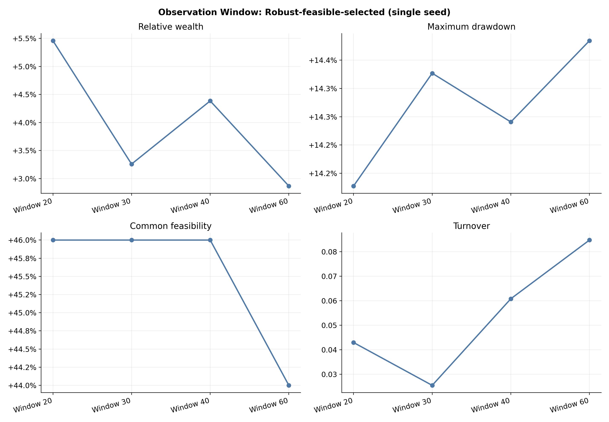

### Drawdown-margin sweep

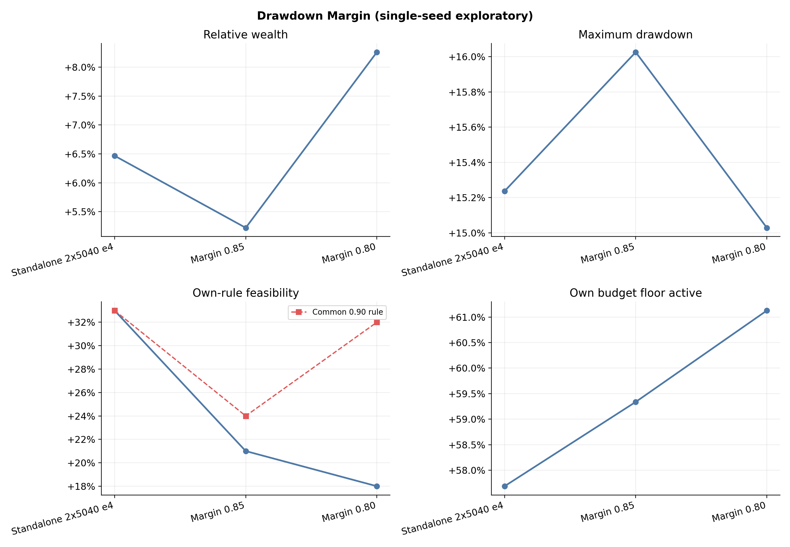

### Drawdown-margin robust-feasible-selected sweep

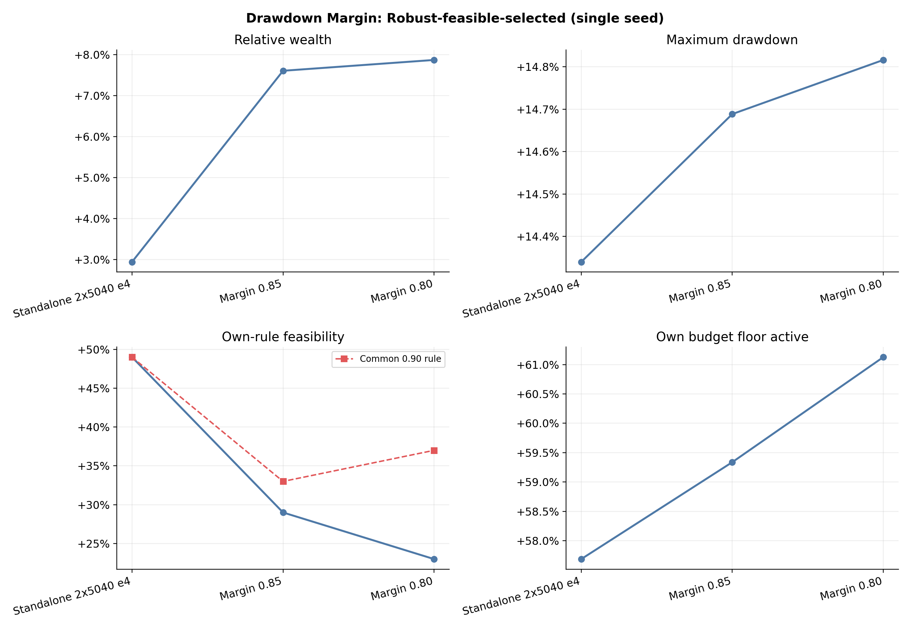

### Validation-to-holdout gap

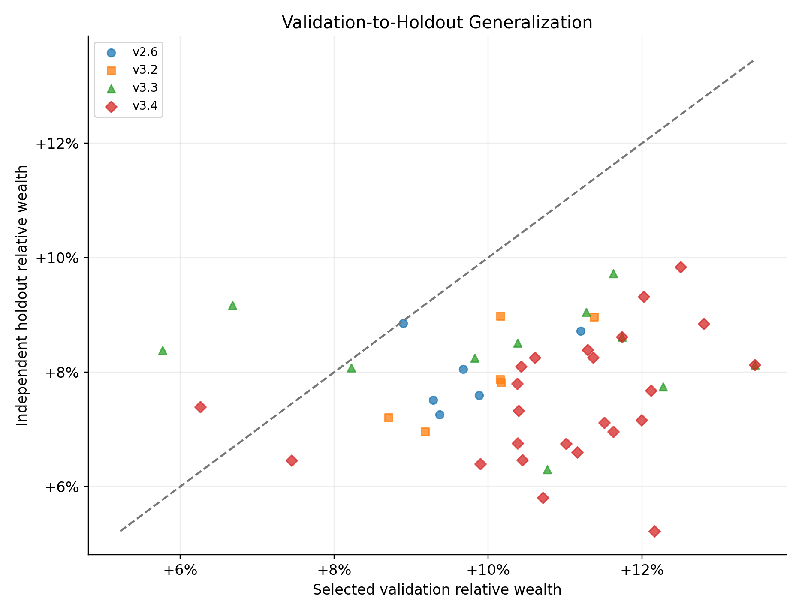

## Interpretation Rules

- V3.4 replicated comparisons use all three seeds and are the main evidence.
- V3.3, observation-window, and drawdown-margin results are single-seed exploratory evidence.
- Branches from the same anchor are not treated as independent training replications.
- Allocation feasibility is guaranteed by CAOSD and independently checked during evaluation.
- A higher own-rule feasible rate under a stricter margin is not sufficient evidence by itself; the common 0.90 rule is used for cross-margin comparison.

## Discussion Questions

1. Do market-count or epoch effects remain consistent across all three seeds?
2. Does counterfactual reward improve tail performance as well as mean return?
3. Is the robust-feasible-selected checkpoint giving a useful return-risk trade-off on unseen anchors?
4. Are the window and margin trends strong enough to justify multi-seed confirmation?
5. How much checkpoint-selection optimism remains between validation and independent holdout?

## Limitations

- V3.3 and the V3.4 window/margin sweeps use one seed. The larger paired holdout cannot replace independent training seeds.
- Three V3.4 seeds support direction and variability checks, but not strong significance claims.
- Robust-feasible-selected means selected by training validation criteria; average common holdout feasibility remains below 50%, so it is not a safety guarantee.
- The evidence comes from the synthetic market and fixed allocation constraints. Real-market robustness and alternative constraint definitions remain open.
- Window and margin trends should be treated as hypotheses for a replicated follow-up, not final hyperparameter choices.
